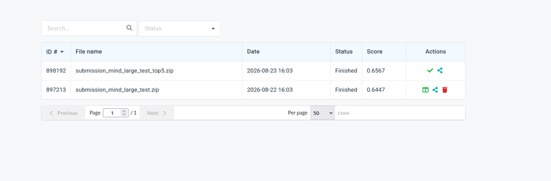
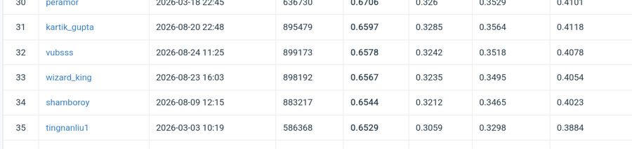
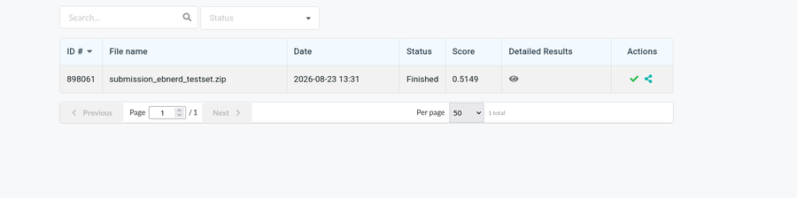
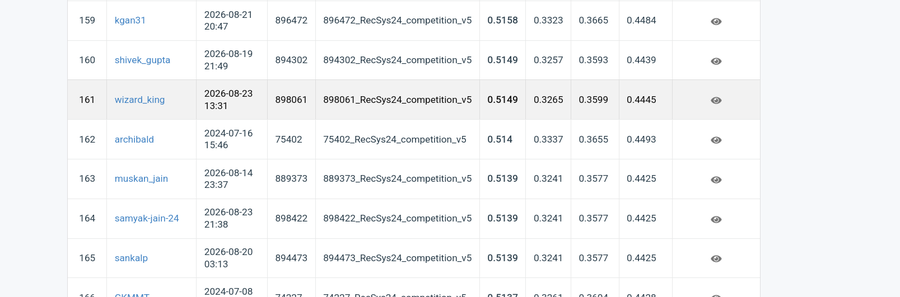

# Design Note — Lexical & Semantic Retrieval on MIND and EB-NeRD

CS4.406 Assignment 1, Part I. All numbers are from `reports/*.json`, produced by
`make all` and reproducible with `make data && make test`.

## 1. Architecture

A five-stage pipeline (`download → clean → split → feature store → retrieval →
evaluation`) that runs identically on both datasets. The load-bearing decision is
that **only `clean.py` knows a dataset name**. Two adapters emit one schema:
`articles` (wide, one row/article), `impressions` (nested, `inview_ids`/
`clicked_ids` as lists — the impression is the evaluation unit, so storing it long
would force a `groupby` over millions of groups to rebuild structure just
discarded), and `history` (long, one row/click — leakage checks need individual
events). `explode_impressions()` materialises a long view on demand.

Everything downstream branches on **capability flags** (`has_body`,
`has_published_time`, `has_provided_embeddings`), never on the dataset name. Where
a dataset genuinely lacks a capability the harness prints `N/A` — MIND has no
`published_time`, so the freshness-restricted pool is reported unavailable rather
than silently substituted.

## 2. Choices and alternatives

**BM25 implemented directly, not `rank_bm25`.** A real inverted index
(`term → postings`) materialised as a sparse matrix of precomputed BM25 weights,
so scoring is one sparse matrix product — `rank_bm25` scores one document at a
time; at 65k docs × 17k queries that is hours, versus 54s.

**pandas throughout, not polars** — one DataFrame API for both datasets; the cost
is object-dtype list columns from parquet, confined to `src/common/io.py`.

**Exact FAISS (`IndexFlatIP`) as reference, HNSW as the ANN** — at this corpus size
exact search is milliseconds, so HNSW is measured rather than needed (§5).

**Per-dataset encoders**: EB-NeRD uses the shipped Danish word2vec vectors; MIND is
encoded with `all-MiniLM-L6-v2`. A single multilingual encoder would make
cross-dataset numbers comparable but discards the provided vectors and costs 11 GPU
minutes for Danish text it handles worse. **Consequence: semantic recall is not
comparable across datasets** — only BM25-vs-semantic *within* a dataset, and BM25
across datasets, are fair comparisons.

## 3. Bugs and validation

Three bugs surfaced, each caught by treating no derived number as trustworthy
until something independent confirmed it.

**EB-NeRD history-snapshot leak.** EB-NeRD ships one history snapshot per split
directory, each covering the 21 days *before* that split — the validation snapshot
spans `05-04→05-25`, the entire train window (`05-18→05-25`). My first `clean.py`
collapsed the two snapshots, giving train impressions access to clicks during/after
them. Both are now kept and tagged; `split.py` pairs each split with the newest
snapshot that ends before it starts:

| split | history ends | split starts | gap |
|---|---|---|---|
| train | 05-18 06:59 | 05-18 07:00 | +12 s |
| val | 05-18 06:59 | 05-24 00:00 | +5 d |
| test | 05-25 06:59 | 05-25 07:00 | +21 s |

(train's gap was **−7 days** before the fix.) `test_no_leakage.py` pins this.

**Profile-split filter dropped in a later refactor.** A scoring routine shared
between the harness and submission scripts (§6) filtered user profiles by
`user_id` only, not `(user_id, split)`. 1,590/1,935 EB-NeRD users have genuinely
different click histories per split (staggered snapshots), so an arbitrary
duplicate row could win — silently mixing in the wrong split's history. MIND was
accidentally unaffected (one snapshot reused everywhere), which is why it went
unnoticed there. Caught by noticing the fitted hybrid weights were implausible
(`4.29·bm25 + 0.20·semantic`) and correcting to `0.32·bm25 + 0.20·semantic` after
`src/retrieval/hybrid.py::score_split` was made to require the split name
explicitly.

**MRR formula bug, caught by Microsoft's official `evaluate.py`**, run against my
MIND submission (`MINDsmall_dev` as ground truth) — an independent check of the
metric code, not just the file format:

| metric | official | mine (before fix) | agree? |
|---|---|---|---|
| AUC | 0.6299 | 0.6301 | yes |
| nDCG@5 | 0.3311 | 0.3317 | yes |
| nDCG@10 | 0.3907 | 0.3918 | yes |
| MRR | 0.3041 | 0.3491 | **no** |

Mine took the reciprocal rank of the *first* click only; the official definition
sums `1/rank` over *every* click and divides by the click count — identical on
single-click impressions, diverging on MIND's 27.9% multi-click share, which had
inflated my MRR by 0.045. Fixed in `src/eval/metrics.py`, pinned by
`tests/test_metrics.py`. Three correct metrics gave no hint the fourth was wrong.

Two smaller facts also shaped the code: MIND numbers impressions from 1 in *both*
files (73,152 dev ids collide with train ids — the schema keeps a unique
`impression_id` plus the raw `source_impression_id` submissions must echo), and
7,233 MIND articles contain a double-quote that pandas' default `QUOTE_MINIMAL`
silently swallows.

## 4. Observations

**Ranking (test split, AUC, n=20,000/5,000). Semantic uses top-5 pooling; hybrid
is a logistic regression over (bm25, semantic) fit on val, replacing a fixed
α=0.5 blend (§6):**

| scorer | MIND | EB-NeRD |
|---|---|---|
| random | 0.4988 | 0.4986 |
| popularity | 0.4955 | 0.4685 |
| bm25 | 0.5671 | 0.5098 |
| semantic | **0.6375** | **0.5195** |
| hybrid (learned) | 0.6337 | 0.5169 |

**Semantic now leads on both datasets.** Under mean-pooling the two arms were
indistinguishable on EB-NeRD with BM25 slightly ahead; top-5 pooling flipped that,
though EB-NeRD's margin (0.520 vs 0.510) is far smaller than MIND's (0.638 vs
0.567) — likely embedding quality, not language: MiniLM targets semantic
similarity, while EB-NeRD's word2vec vectors are averaged statics that blur topic
(the case for re-encoding Danish locally, §6).

**Popularity scores at or below random within an impression** (0.4955 MIND, 0.4685
EB-NeRD) because the inview list is **already popularity-curated by the production
system** — globally popular articles appear mostly as negatives, leaving popularity
no discriminative power inside a list, even though it separates head vs tail
impressions cleanly from the outside (head-click nDCG@10: 0.549 MIND / 0.885
EB-NeRD for popularity, vs ~0.21–0.39 for content scorers).

**Q9 serving-time ablation (EB-NeRD only, MIND has no such columns).**
`total_pageviews` is an article-level count aggregated over its *entire lifetime*
— future relative to any given split — so ranking with it directly is a serving-time
violation. Swapping it in for the honest train-only popularity feature: **AUC
0.4685 → 0.5960, +0.1275**, beating every legitimate scorer including hybrid
(0.5169). `load_leaky_popularity` builds this feature only when
`serving_time_unavailable` is declared, and is never used by any real scorer;
`tests/test_no_leakage.py::test_serving_time_ablation_declared_not_faked` pins
both that MIND correctly reports it unavailable and that the feature genuinely
varies. The size of the inflation is itself the finding: a feature this "good" is
a red flag, not a win.

**Recall is low and pool choice dominates it** (still mean-pooled — porting top-5
pooling here is a remaining step, §6):

| dataset | pool | size | BM25 r@50 | semantic r@50 | random r@50 |
|---|---|---|---|---|---|
| MIND | all | 65,238 | 0.0062 | 0.0076 | 0.0008 |
| MIND | circulating | 4,174 | 0.0483 | **0.0751** | 0.0120 |
| EB-NeRD | all | 11,777 | 0.0095 | 0.0055 | 0.0042 |
| EB-NeRD | circulating | 2,634 | **0.0261** | 0.0216 | 0.0190 |

Only 8.2%/23.2% of the catalogue circulates during the test window, so
full-catalogue recall understates a serving system — but `circulating` is derived
from the eval split itself, an optimistic bound rather than a deployable filter;
both are reported.

**Almost nothing carries over between train and test** — only 3.9% (MIND) / 1.3%
(EB-NeRD) of test-window clicks land on a train-clicked article, bounding what any
content-only retriever can achieve and explaining why popularity scores below
random rather than merely weakly.

**Recency-weighted pooling did not help** (EB-NeRD r@50 0.0216→0.0226, MIND
0.0751→0.0710) — exponential decay over 20 clicks discards topical breadth mean
pooling keeps.

**Cold-start users score higher than warm** on both (MIND semantic nDCG@10: cold
0.410 vs warm 0.394) — an artefact of shorter inview lists making a correct guess
likelier, not better modelling. EB-NeRD's shortest history is 5 clicks, so an
absolute "<5" threshold selects nobody there; the harness uses a within-dataset
bottom-quartile band instead.

## 5. Where it breaks at 10×

| Component | Behaviour at 10× | Fix |
|---|---|---|
| BM25 score matrix | 650k docs × 256-row batch densifies to 666 MB | Shrink batch, or WAND/block-max |
| `explode_impressions` | 5.8M rows today; 58M at 10× exceeds 14 GB RAM | Chunk by impression range, or out-of-core |
| FAISS flat index | 100 MB now, 1 GB at 10×, but search is linear in corpus size | HNSW — already implemented and measured |
| HNSW recall | **Already degrading**: 0.926 on 4,174 articles, **0.769** on the full 65,238 at `efSearch=64` | Raise `efSearch`/`M`, re-measure — default unsafe at scale |
| Article encoding | 11 min for 65k on a 4 GB GPU, CUDA OOM at batch 256 | Batch 128, fp16, or shard; cached by article-id hash |
| Per-user query cache | One query/user in RAM; 940k users at 10× | Shard by user, or stream |

The HNSW row already bites: ANN recall against the exact index falls from 0.926 to
0.769 purely by growing the pool 16× at fixed parameters.

## 6. Future Work

**Done: top-5 similarity pooling** instead of mean-pooling — score a candidate by
the mean of its 5 highest similarities to individual history clicks, rather than
mean-pooling history into one vector first (which averages away the niche interest
that explains the click). Swept k on MIND val (peak at 5); confirmed on the
official scorer (AUC 0.6299→0.6414) and **reproduced on the real MIND leaderboard**
at 2.37M-impression scale (0.6447→**0.6567** AUC, §7). Two rejected features:
candidate position (exactly random — MIND shuffles inview order) and popularity
(0.5001 alone); blending either into the top-5 score makes it worse, consistent
with the 3.9% item carryover above.

**Done: learned hybrid combination** instead of fixed α — a logistic regression
over per-impression min-max-normalised (bm25, semantic), fit on val and applied
frozen to test. This fixed the *worst* failure of a bad fixed α (α=0.5 lost to
semantic alone on MIND: 0.6209 vs 0.6301) but the honest result is that on both
datasets the best single scorer still edges out the learned blend (MIND 0.6337 vs
0.6375; EB-NeRD 0.5169 vs 0.5195; official scorer 0.6377 vs 0.6414). Shared by the
harness and both submission paths via `src/retrieval/hybrid.py`.

**Remaining, in priority order:**
1. Re-encode EB-NeRD with a real multilingual model — word2vec gives +0.02 AUC over
   random, MiniLM gives MIND +0.14 through the identical code path.
2. Port top-5 pooling into `recall_at_k` — it still measures mean-pooled recall.
3. Model recency explicitly — 1–4% item carryover suggests publication age
   plausibly dominates content similarity; `published_time` is already plumbed for
   EB-NeRD.
4. Evaluate on the full split and raise HNSW `efSearch` to recover the recall lost
   at full corpus size.

## 7. Codabench

Both leaderboards were submitted to and scored.

**MIND** (comp. 13967, Official Test phase): `MINDlarge_test` (2,370,727
impressions, 120,961 articles, unlabelled), via `src/submission/predict_raw_mind.py`.

| submission | method | AUC | MRR | nDCG@5 | nDCG@10 |
|---|---|---|---|---|---|
| `submission_mind_large_test.zip` | semantic, mean-pool | 0.6447 | — | — | — |
| `submission_mind_large_test_top5.zip` | semantic, top-5 pool | **0.6567** | 0.3235 | 0.3495 | 0.4054 |

Top-5 pooling's local win reproduces on the real leaderboard at full scale: **+0.012
AUC** over mean-pooling.

**EB-NeRD** (comp. 2469): scored on the real `ebnerd_testset`, not a validation dry
run — the original plan was to skip the 1.5 GB download, but the testset was
fetched via `make ebnerd-testset` and a genuine submission produced instead. Via
`src/submission/predict_ebnerd_test.py`, semantic mean-pool: **AUC 0.5149**.

